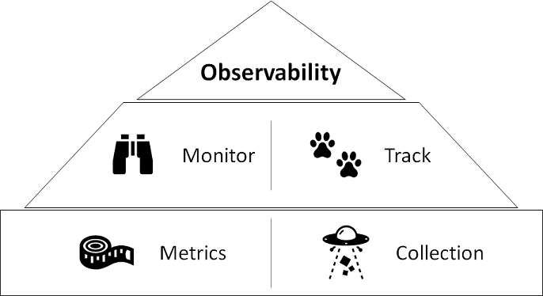

# Project Goal

The Azure ML Observability solution accelerator provides libraries for model monitoring and data drift analysis.

## Overview

__How to trust a deployed model, a model in operation?__ 

In order to answer the question, we need to have an [Observability](https://docs.microsoft.com/en-us/azure/cloud-adoption-framework/manage/monitor/observability). The observability _is a qualitative indicator that a monitoring solution helps the monitoring consumer achieve the satisfactory level of control of a defined service, where monitoring provides service consumers with a suitable range of monitoring capabilities and perspectives_.

To have the observability, we need to __monitor__ metrics and __track__ logs. Monitoring is about using various metrics to measure the model behavior. And to compute the metrics we need collect records of data in logs that are produced during the prediction of models. So tracking logs has to be done before computing the metrics.



If you are new to these tasks, it is not easy to start. So this solution accelerator will provide easy way to provision associated Azure Resources to collect logs and calculate metrics. Even you can use dashboard templates that are included in this repo to monitor metrics.

In addition to that, this solution will provide a library to help you to monitor data drift.

## Solution accelerator architecture


__Library components__

|Name|Description|
|--|--|
|`Data Collection`| Capture data from multiple sources, Spark, Real-time and Batch|
|`Monitoring` | Visualize metrics|
|`Drift Analysis`| Detect data drift|
|`Management`| Provision Azure Resources (infrastructure) for AML-Observability|

## Solution Architecture

The solution is built on top of Azure Data Explorer and Azure ML


## Quick Start

### Install

To install early release version:

1. For Data Collection to ingest data:

    ```pip install --upgrade git+https://github.com/microsoft/AzureML-Observability#subdirectory=aml-obs-collector```  
2. For client library: 

    ```pip install --upgrade git+https://github.com/microsoft/AzureML-Observability#subdirectory=aml-obs-client```

    ```pip install azure-ai-ml==0.0.62653692 --extra-index-url https://azuremlsdktestpypi.azureedge.net/sdk-cli-v2```


### Check out quick start notebooks

[1. Solution provisioning](./quick_start/0_provision.ipynb)

    This notebook will help you to understand how to provision Azure Resources

[2. Monitoring](./quick_start/1_monitoring.ipynb)

    This notebook will help you to understand how to collect data. To monitor metrics, you need to import ADX dashboard template to ADX that you created from the previous notebook _1. Solution provisioning_

[3. Drift](./quick_start/2_drift.ipynb)

    This notebook will help you to understand how to run data drift detection job

## Contributing

This project welcomes contributions and suggestions.  Most contributions require you to agree to a
Contributor License Agreement (CLA) declaring that you have the right to, and actually do, grant us
the rights to use your contribution. For details, visit https://cla.opensource.microsoft.com.

When you submit a pull request, a CLA bot will automatically determine whether you need to provide
a CLA and decorate the PR appropriately (e.g., status check, comment). Simply follow the instructions
provided by the bot. You will only need to do this once across all repos using our CLA.

This project has adopted the [Microsoft Open Source Code of Conduct](https://opensource.microsoft.com/codeofconduct/).
For more information see the [Code of Conduct FAQ](https://opensource.microsoft.com/codeofconduct/faq/) or
contact [opencode@microsoft.com](mailto:opencode@microsoft.com) with any additional questions or comments.

## Trademarks

This project may contain trademarks or logos for projects, products, or services. Authorized use of Microsoft 
trademarks or logos is subject to and must follow 
[Microsoft's Trademark & Brand Guidelines](https://www.microsoft.com/en-us/legal/intellectualproperty/trademarks/usage/general).
Use of Microsoft trademarks or logos in modified versions of this project must not cause confusion or imply Microsoft sponsorship.
Any use of third-party trademarks or logos are subject to those third-party's policies.
